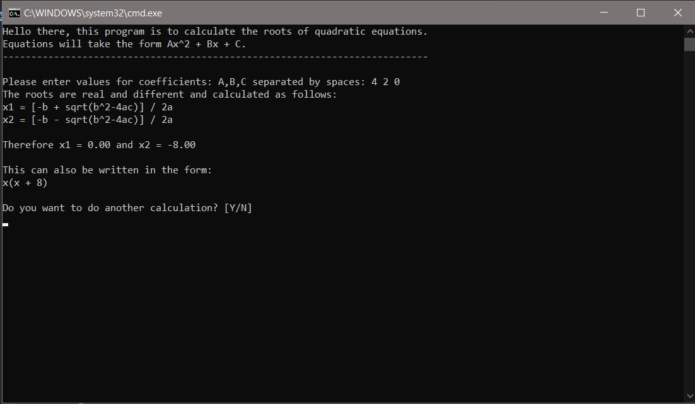
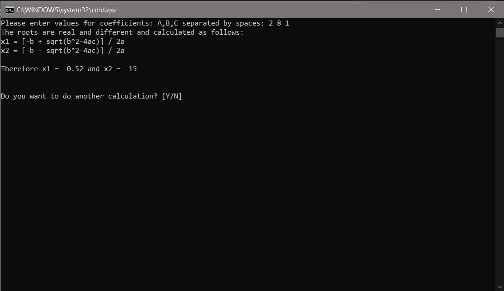

# QUADRATIC_EQUATION_QUESTION
Program to check and tell roots of quadratic equations, from Computer Science First Semester 2019 exams, question C1

## POSSIBLE UPDATES:
- user input validation

## SCREENSHOTS

